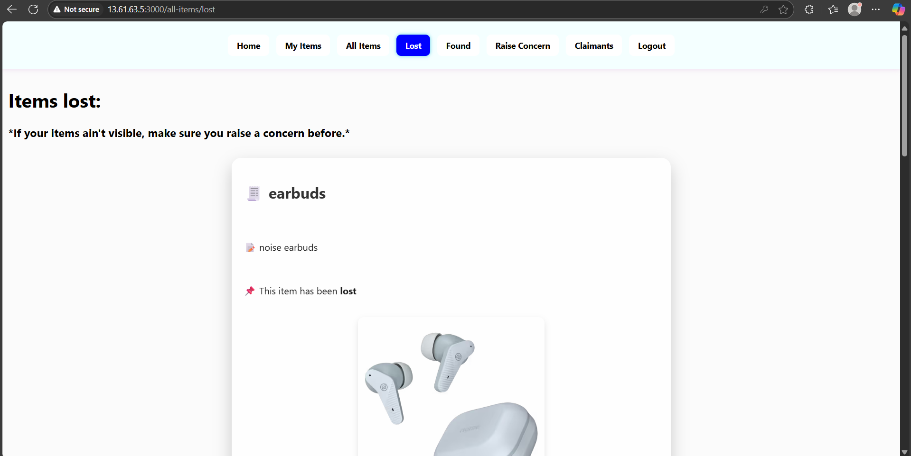

# Lost and Found Web Application

A cloud-ready Lost and Found web platform built for college campuses, designed to help students and staff efficiently report, search, and recover lost items. Developed with a DevOps-first approach, the application supports automated deployment, real-time feedback, and high scalability.

---

## 📌 Overview

In campus environments, lost belongings are a common challenge. This web-based Lost and Found system simplifies the recovery process by providing a centralized, searchable platform where users can report, track, and claim lost items. Built with modern DevOps methodologies, the application is continuously integrated, tested, and deployed for maximum reliability and speed.

---

## 🚀 Key Features

- **User-Friendly Reporting**: Students and staff can report lost or found items with detailed descriptions and images.
- **Search and Match**: Smart search features help users find relevant item listings.
- **Notifications**: Get alerted when matching items are found or claimed.
- **CI/CD Integration**: Built with Jenkins and GitHub Actions for seamless continuous deployment.
- **Dockerized Architecture**: Containerized for consistent development, testing, and production environments.
- **Cloud-Ready**: Easily deployable to cloud platforms for horizontal scalability.
- **Admin Dashboard**: Tools for administrators to monitor activity and generate reports.

---

## 🔧 Tech Stack

- **Frontend**: HTML, CSS, JavaScript, React
- **Backend**: Node.js, Express.js
- **Database**: MongoDB
- **DevOps**:  
  - **Version Control**: GitHub  
  - **CI/CD**: Jenkins  
  - **Containerization**: Docker
  - **Server**: AWS EC2

---

## 🎯 Objectives

- Centralized platform for managing lost and found items
- Streamlined process for students and staff to report and search listings
- Automated matching and alert system for faster resolution
- Continuous delivery pipeline for frequent and safe updates
- Secure, scalable cloud infrastructure with real-time monitoring
- Support for admin-level analytics and platform improvement

---

## ✅ DevOps Integration

This project integrates DevOps practices from the ground up:

- **CI/CD**: Automated builds, tests, and deployments using Jenkins and GitHub
- **Containerization**: Docker used for isolated, reproducible environments
- **Monitoring**: Real-time system tracking and alerts for admins
- **Version Control**: GitHub repository for collaborative development

---

You can access the web application here:
http://13.61.63.5:3000/

---

## ⚠️ Important Notice

Due to the possibility of **AWS account suspension**, the live deployment of this application may not be accessible at this time.

To demonstrate the functionality and user experience, **key features are shown through screenshots**.

AWS EC2 instances;

Jenkins Pipeline;

Home Page;

Successful Login;

Items Lost;

Items Found;

Report Items;

Claimants List;

